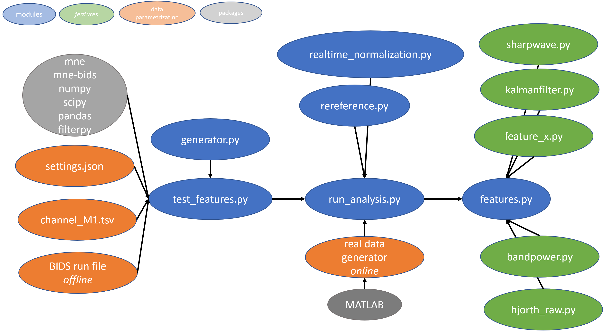
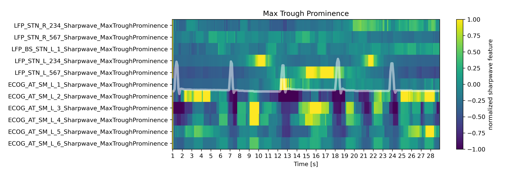

# py_neuromodulation

The py_neuromodulation module allows for real time capable processing of multimodal electrophysiological data. The primary use is movement prediction for adaptive deep brain stimulation (https://pubmed.ncbi.nlm.nih.gov/30607748/).

For running this toolbox first create a new virtual conda environment: 
`conda create --name pyneuromodulation`

Then activate it:
`conda activate pyneuromodulation`

and install the required packages:
`pip install -r requirements.txt`

Internally a generator get's initialized which simulates a continuous data stream, as well as a feature object. 
In settings.json different preprocessing parameter and feature generation types can be specified. 
The current implementation allows two different kinds of features: 
 - bandpower 
 - sharpwave osicillations 

For bandpower features the Hjorth parameter can be used, as well as a Kalmanfilter for individual frequency bands. 
In run_analysis.py the data is read, real time enabled normalization and rereference functions are called. Subsequently the specified features are calculated and written out to a time stacked dataframe. Functions have been optimized with respect to computational efficiency, and are encapsuled such that a hardware interface can easily replace the internal signal generator. 

*Figure 1: py_neuromodulation modules*

*Figure 2: Examplary prominence sharpwave features over time*

In addition, a computational interpolation approach was implemented that allows for decoding with different electrode locations. Here different interpolation parameters for cortical (ECoG) and subcortical (LFP) signals can be defined. 